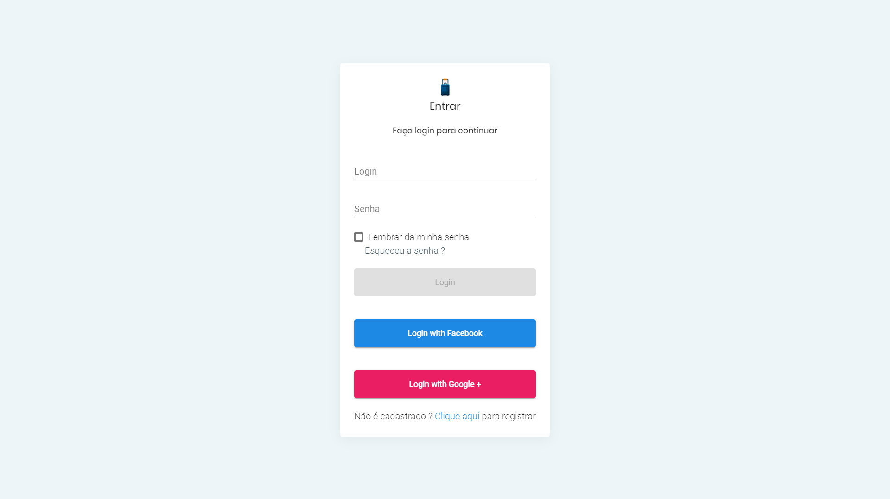
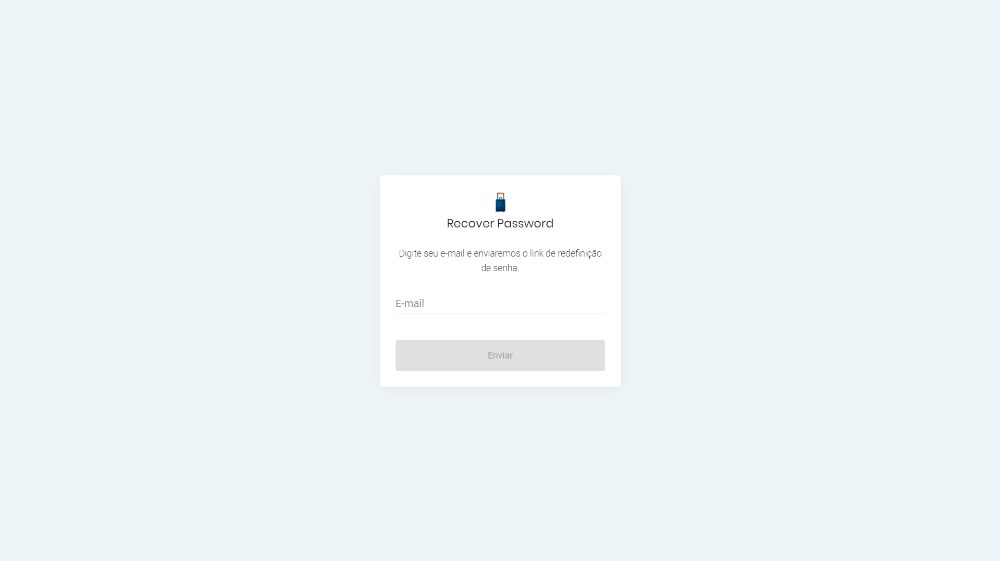
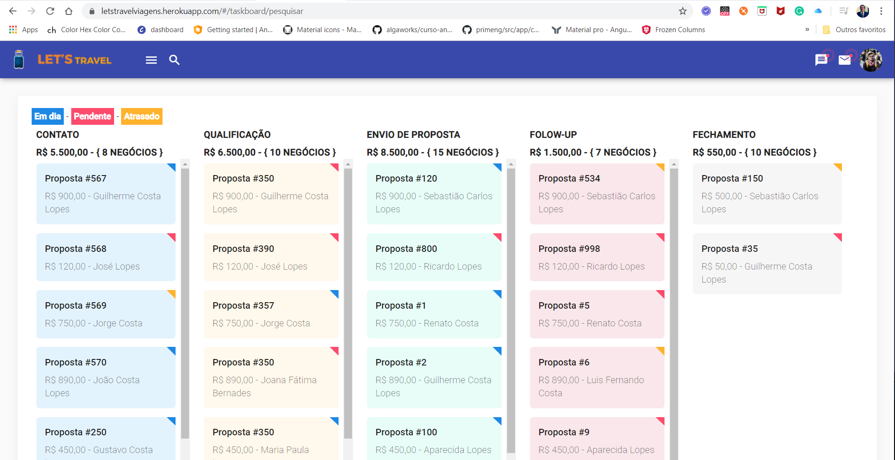
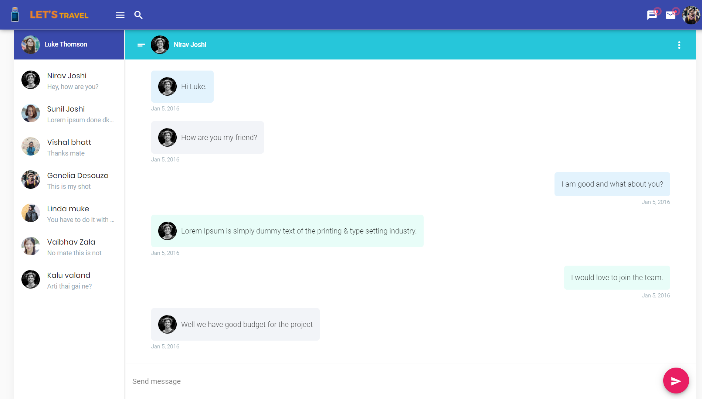

# Hacka Gr1d - Pocket

## Desafio

Nesse mundo cada vez mais dinâmico e aberto, o desafio do **Hacka Gr1d** é buscar novas soluções para apoiar as corretoras de seguros a fazerem sua transformação digital utilizando os diferentes serviços que a Plataforma de Negócios oferece.

E para encarar esse desafio você não estará sozinho! Além de seu time, mentores experts no assunto (feras em negócios, tecnologia e seguros!) darão todo o suporte para que vocês consigam colocar as suas ideias em prática e construir um protótipo vencedor! Vocês terão 36 horas seguidas para criar e apresentar um projeto inovador que não apenas solucione o problema proposto, mas também que conquiste os jurados e o grande prêmio do **Hacka Gr1d** !

## REALIZAÇÃO

https://shawee.io/

## ORGANIZAÇÃO

https://insurance.gr1d.io/

## Sistema: Let's Travel

É uma plataforma que conecta os corretores com os futuros viajantes e pessoas que não entendem o valor do seguro em viagens, mas querem planejar bem  sua viagem internacional de forma fácil e agradável.

# Frameworks

Aplicação em Angular 9.

## Principais Depedências:

1) Angular, ;
2) Fullcalendar, ;
3) Angular Material, ;
4) ng2-charts, ;
5) bootstrap, ;

## Outros códigos fontes:

Mobile - https://github.com/Vickout/HackaGr1d_Mobile

backend - https://github.com/jorge-lba/gr1d

## Publicação

Utiilizamos o ```heroku``` para publicação de nosso app ```frontend```. Utilizando o endereço: https://letstravelviagens.herokuapp.com/#/authentication/login

## Telas

### tela de Login

### tela de registro

### tela de esqueceu a senha

### tela de calendário

### tela de funil de vendas

### tela de todas as mensagens do usuário logado

### tela de todas as notificações do usuário logado

### tela de chat do usuário logado


## Autor

- [Guilherme Lopes](https://github.com/guilhermecostalopes)

## Colaboradores

- [Anne Cris](https://github.com/annecris)
- [Addae do Carmo](https://github.com/addaedocarmo)
- [Jorge Alegretti](https://github.com/jorge-lba)
- [Victor Lourenço](https://github.com/Vickout)
